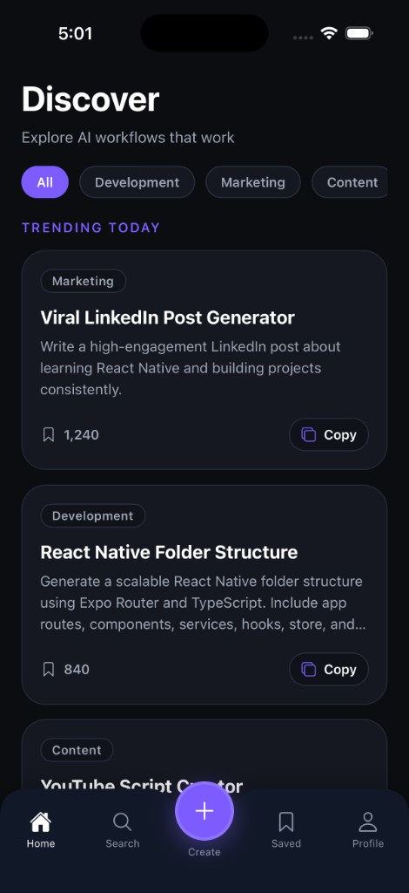
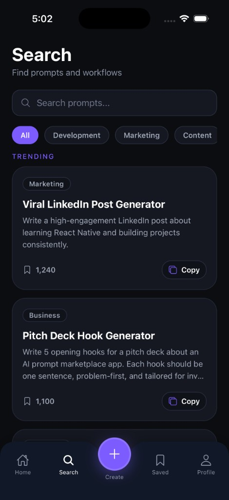
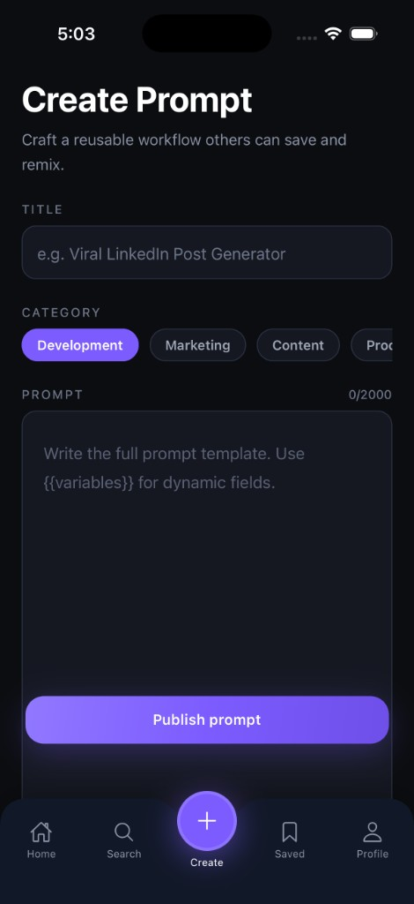
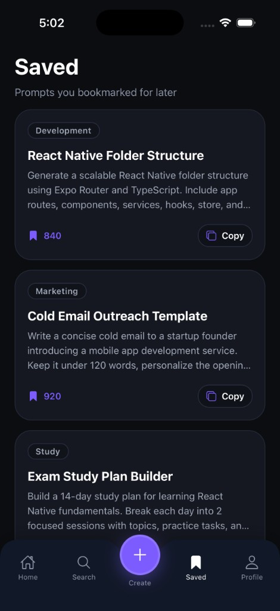
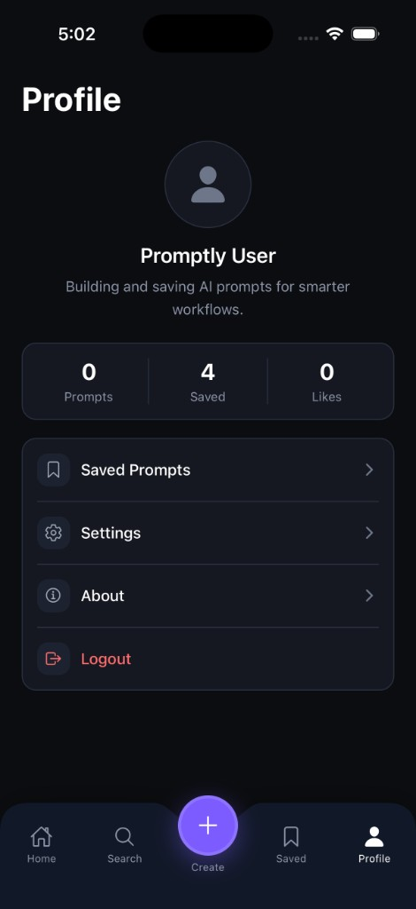

# Promptly

Promptly is a React Native app built with Expo and Expo Router that helps users discover, create, search, and save AI prompt workflows.

## Features

- Home feed for discovering prompts by category
- Search with filters and trending prompt suggestions
- Create new AI prompts with title, category, tags, and body text
- Save prompts locally for later reuse
- Prompt detail view with copy and save actions
- Firebase integration for prompt storage and anonymous authentication
- Modern dark UI built with NativeWind and Tailwind-style styles

## Screenshots

| Discover | Search |
| --- | --- |
|  |  |

| Create Prompt | Saved |
| --- | --- |
|  |  |

| Profile |
| --- |
|  |

- **Discover** — browse trending prompts by category
- **Search** — find prompts with filters and trending suggestions
- **Create Prompt** — publish new workflows with tags and categories
- **Saved** — access bookmarked prompts
- **Profile** — view stats and account options

## Tech stack

- Expo SDK 56
- Expo Router
- React Native 0.85
- TypeScript
- Firebase Firestore + Firebase Auth
- NativeWind + Tailwind CSS
- Zustand for saved prompt state
- Expo Vector Icons, Linear Gradient, Clipboard

## Getting started

1. Install dependencies:

```bash
npm install
```

2. Create a `.env` file in the project root and add your Firebase config using Expo public env variables:

```env
EXPO_PUBLIC_FIREBASE_API_KEY=your_api_key
EXPO_PUBLIC_FIREBASE_AUTH_DOMAIN=your_auth_domain
EXPO_PUBLIC_FIREBASE_PROJECT_ID=your_project_id
EXPO_PUBLIC_FIREBASE_STORAGE_BUCKET=your_storage_bucket
EXPO_PUBLIC_FIREBASE_MESSAGING_SENDER_ID=your_messaging_sender_id
EXPO_PUBLIC_FIREBASE_APP_ID=your_app_id
EXPO_PUBLIC_FIREBASE_MEASUREMENT_ID=your_measurement_id
```

3. Run the project:

```bash
npm start
```

4. Open on your device/simulator:

```bash
npm run android
npm run ios
npm run web
```

## Project structure

- `app/` – Expo Router screens and navigation
- `components/` – UI components such as prompt cards, forms, and tab bar
- `constants/` – prompt categories and sample seed data
- `services/` – Firebase setup and prompt CRUD logic
- `store/` – Zustand local state for saved prompts
- `types/` – TypeScript definitions

## Firebase notes

- The app uses anonymous authentication via Firebase Auth.
- Prompts are stored in Firestore under the `prompts` collection.
- `services/firebase.ts` requires valid `EXPO_PUBLIC_*` env variables.

## Scripts

- `npm start` – start Expo dev server
- `npm run android` – launch Android
- `npm run ios` – launch iOS
- `npm run web` – launch web

## Notes

- The app is configured as a private project in `package.json`.
- `App.tsx` contains a minimal placeholder because the app uses Expo Router entry points.

---

Enjoy building with Promptly!
